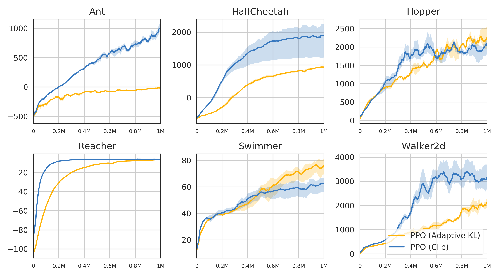

# Proximal Policy Optimization

An implementation of PPO (clipping and KL-divergence) using Tensorflow. The results on some [Mujoco](http://www.mujoco.org/) tasks have been reproduced as in the [PPO](https://arxiv.org/abs/1707.06347) paper.

## Acknowledgements

This repository is a blend of the Pytorch repository [mjrl](https://github.com/aravindr93/mjrl) and [OpenAI baselines](https://github.com/openai/baselines).
